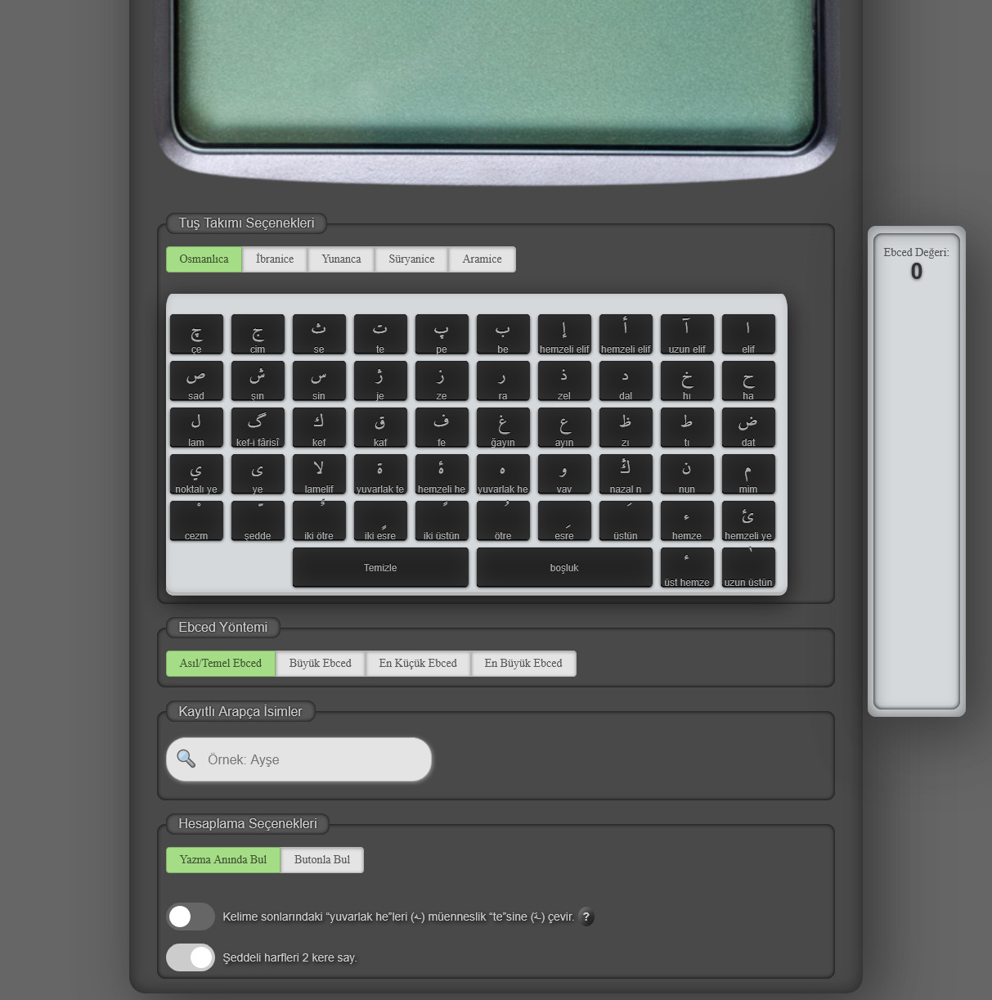

# 📟 Gelişmiş Ebced Hesaplama Makinesi

Antik ve kadim dillerin numerolojik (Ebced / Isopsephy) değerlerini modern web standartlarıyla hesaplayan, yüksek performanslı ve genişletilebilir bir hesaplama motorudur.

## 🌟 Öne Çıkan Özellikler

* **Beş Kadim Dil Desteği:**
  * 🇹🇷 **Osmanlıca / Arapça:** Asıl (Temel), Büyük, En Küçük ve En Büyük Ebced mertebeleri ile tam entegrasyon.
  * 🇮🇱 **İbranice:** Temel harf değerleri ve özelleştirilmiş sanal klavye eşleşmesi.
  * 🇬🇷 **Yunanca (Isopsephy):** Küçük harf standardizasyonu içeren antik sayısal değer optimizasyonu.
  * 🇸🇾 **Süryanice:** 1800'lü Unicode bloklarına sahip tam katalog desteği.
  * 📜 **Aramice:** İbranice kod varyasyonlarıyla tam uyumlu numerolojik altyapı.
* **Akıllı Hafıza Yönetimi (`localStorage`):** Kullanıcı deneyimini artırmak amacıyla, sayfa yenilendiğinde en son seçilen hesaplama yöntemini hafızasında saklar. Hiçbir kayıt yoksa güvenli varsayılan olarak "Asıl Temel Ebced" modunda açılır.
* **Dinamik DOM ve UI Kontrolü:** Seçilen dile göre arayüzü anlık olarak manipüle eder. Osmanlıca dışındaki dillerde (Süryanice, Aramice vb.) geçerli olmayan hesaplama yöntemlerini (Büyük, En Büyük vb.) dinamik olarak gizleyerek jilet gibi temiz bir arayüz sunar.
* **Pürüzsüz ve URL Dostu Kaydırma:** Sayfa içi odaklanmalarda adres çubuğunu kirleten ve tarayıcı geçmişini bozan `window.location` yapısı yerine; optimize edilmiş, akıcı (`smooth`) ve performanslı bir `scrollIntoView` altyapısı (`kaydir()`) kullanır.
* **Veritabanı Entegrasyonu ve Otomatik Tamamlama:** `isimler.js` veritabanı üzerinden anlık arama desteği, Unicode ayrım güvenliği (`split("\u00B7")`) ve dinamik cinsiyet emojileri (`👩`, `👨`) ile zenginleştirilmiş autocomplete listesi.

## 🛠️ Teknoloji Yığını ve Mimari

* **Arayüz (Frontend):** HTML5, CSS3 (Custom Glassmorphism, Özel Gölgelendirmeler ve Retro Terminal Esintileri)
* **Motor (Scripting):** Pure Vanilla JavaScript (Merkezi JSON Sözlük Kataloğu `ebcedKatalog` mimarisi)
* **Kütüphane Desteği:** jQuery (Arayüz element yönetimi için minimum bağımlılık)

## 📂 Proje Klasör Yapısı

```text
├── css/
│   └── ebced.css          # Retro terminal görsel stil ve animasyon dosyası
├── javascript/
│   ├── ebced.js           # Ana hesaplama motoru ve merkezi harf sözlük kataloğu
│   ├── panel.js           # Dinamik UI/DOM yönetimi ve klavye tetikleyicileri
│   ├── isimler.js         # Otomatik tamamlama için entegre isim veritabanı
│   └── jquery.min.js      # Yardımcı arayüz kütüphanesi
└── index.htm # Ana uygulama arayüzü


